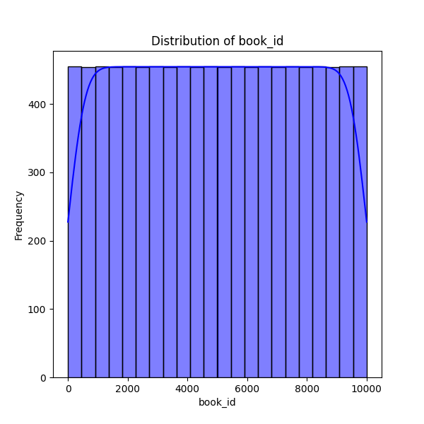
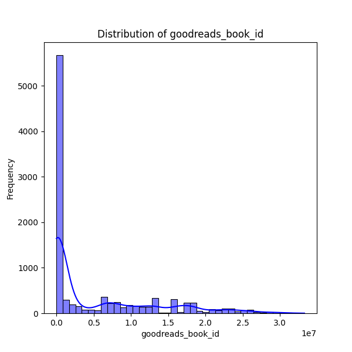
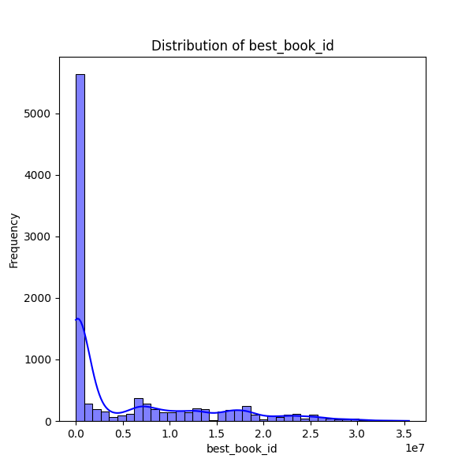

# Analysis Report

### Dataset Summary

The dataset contains information on 10,000 books, with a total of 23 columns. The key columns include identifiers, titles, authors, publication details, and ratings statistics. Some important observations regarding the structure of the dataset are:

- **Identifiers**: Each book has several identifiers, such as `book_id`, `goodreads_book_id`, and `best_book_id`, all of which do not have missing values.
- **Publication Details**: Information on the books’ original publication years ranges from as early as 1750 to 2017, with some entries (21 missing values) lacking a specified year.
- **Titles and Authors**: The dataset has a diverse set of titles (99 unique titles) and authors (4,664 unique authors), contributing to a rich variety of content.
- **Ratings**: The `average_rating` column has a mean of approximately 4.00 on a scale that likely ranges from 1 to 5, indicating that these books are generally well-received. There are also detailed breakdowns of ratings (1-5) across the dataset.
- **ISBN and Language Codes**: Missing values are present for the `isbn`, `isbn13`, and `language_code` columns (700, 585, and 1,084 missing entries respectively), suggesting potential gaps in bibliographic information.
- **Images**: The dataset includes URLs pointing to book cover images, which may enhance visual representation for any applications built using this data.

### Key Insights

1. **High Average Ratings**: With an average rating of 4.00 and a maximum of 4.82, the selected books are likely popular among readers. This could indicate a focus on quality titles, but could also skew perceptions if data is limited to highly rated works.

2. **Variety of Authors**: The high number of unique authors (4,664) suggests a diverse range of genres and styles, appealing to a wide audience. However, a large number of works may skew toward a few prolific authors.

3. **Publication Trends**: A notable concentration of publications can be observed post-2000, which could reflect current trends in reader preferences and publishing practices.

4. **Missing Data**: A substantial portion of missing values in `isbn` (700 missing), `isbn13` (585 missing), and `language_code` (1,084 missing) may limit the applicability of certain bibliographic analyses and could skew insights related to inventory and cataloging.

5. **Visualizations**: The data visualizations focused on the distribution of various identifiers may reveal the dataset’s limitations, such as potential duplicates or gaps in identifier assignment.

### Implications

- **Market Research**: The dataset can serve as a valuable resource for market analysis within the book industry. Insights gathered from average ratings and popular authors can inform marketing strategies.

- **Recommendation Systems**: The high average ratings and diverse author representation indicate potential for building recommendation systems that may cater to a large audience, thus enhancing user experience in platforms like Goodreads or other online bookstores.

- **Data Quality Management**: The presence of missing values in crucial columns underlines the need for data cleaning and validation processes prior to analysis, which could involve sourcing additional bibliographic data or standardizing entries.

- **Trend Analysis**: Researchers interested in publication trends over decades could leverage the original publication year along with ratings data to identify shifts in reader preferences or the rise and fall of particular genres.

In summary, this dataset provides a rich landscape for analysis and development of insights related to the book publishing industry while also exhibiting areas requiring attention regarding data completeness and quality.

