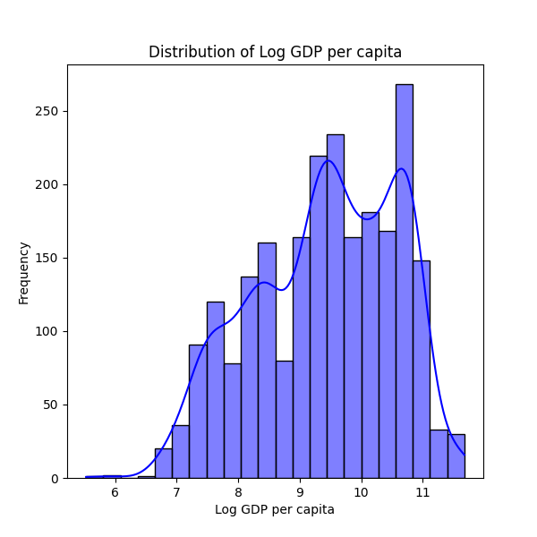

# Analysis Report

### Summary of the Dataset 

The dataset consists of 2,363 entries with 11 features that assess various aspects of well-being and experiences in different countries from 2005 to 2023. The key variables in this dataset include measures of life satisfaction (Life Ladder), economic indicators (Log GDP per capita), social support, health metrics (Healthy life expectancy at birth), freedom of choice, generosity, perceptions of corruption, and positive/negative affects. 

#### Key Characteristics:
- **Year Range:** 2005 - 2023
- **Countries Represented:** 165 distinct countries
- **Missing Values:** Notably, several critical indicators contain missing values:
  - **Log GDP per capita:** 28 missing entries
  - **Social support:** 13 missing entries
  - **Healthy life expectancy at birth:** 63 missing entries
  - **Freedom to make life choices:** 36 missing entries
  - **Generosity:** 81 missing entries
  - **Perceptions of corruption:** 125 missing entries
  - **Positive affect:** 24 missing entries
  - **Negative affect:** 16 missing entries

### Summary Statistics:
- **Life Ladder:** The mean score is approximately 5.48, with a standard deviation of 1.13, indicating moderate life satisfaction across the dataset. The scores range from a minimum of 1.28 to a maximum of 8.02.
- **Log GDP per capita:** The average is 9.40 (on a logarithmic scale), suggesting varied levels of economic prosperity. The minimum value is 5.53 while the maximum is 11.68.
- **Social Support:** The average score here is fairly high at 0.81, implying a generally supportive social environment across the countries in the dataset.
- **Healthy Life Expectancy:** The mean is 63.40 years, with significant variation, indicating disparities in health outcomes across different nations.
- **Freedom to Make Life Choices:** This variable shows a mean of around 0.75, suggesting a relatively high level of freedom in personal choices.
- **Generosity:** Average score is near zero, indicating limited charitable actions or support compared to other measures, with a wide distribution that includes negative values.
- **Perceptions of Corruption:** The average indicates a moderate perception of corruption (0.74), with higher values suggesting a more positive perception regarding corruption levels.
- **Positive Affect and Negative Affect:** These measures show that positive experiences generally outweigh negative ones, with an average positive affect of 0.65, and negative affect at 0.27.

### Key Insights:
1. **Moderate Life Satisfaction:** The relatively high average of the Life Ladder suggests that, despite numerous issues, many people around the world report an acceptable level of life satisfaction.
2. **Economic Disparities:** The range of Log GDP per capita indicates large disparities in economic well-being. Some countries are likely facing economic challenges that impact their citizens' happiness.
3. **Social Support's Role:** High average social support may correlate with life satisfaction, suggesting societies with strong communal relationships contribute to well-being.
4. **Health and Longevity:** The healthy life expectancy average indicates varying health outcomes, which could highlight significant global health issues that need addressing.
5. **Perceptions of Corruption:** High perceived corruption levels could negatively impact national happiness, as citizens may feel helpless against corrupt practices.
6. **Generosity's Anomaly:** The low and highly variable generosity measures may suggest a need for increased philanthropic engagement in many countries.

### Implications:
- **Policy Focus:** Governments should prioritize enhancing economic growth and reducing corruption to positively impact the Life Ladder scores and overall citizen well-being.
- **Social and Health Investments:** Investment in healthcare and social programs could improve life expectancy and social support scores, leading to greater well-being.
- **Promoting Generosity:** Encouraging a culture of giving and social responsibility might contribute to greater community engagement and improved life satisfaction metrics.
- **Research Pathways:** The correlations between these variables warrant further investigation; studies could explore the interconnectedness of economic, social, and psychological factors affecting happiness.

Overall, the dataset provides a comprehensive view of factors that influence happiness and well-being across countries, with significant implications for understanding and improving global quality of life.

