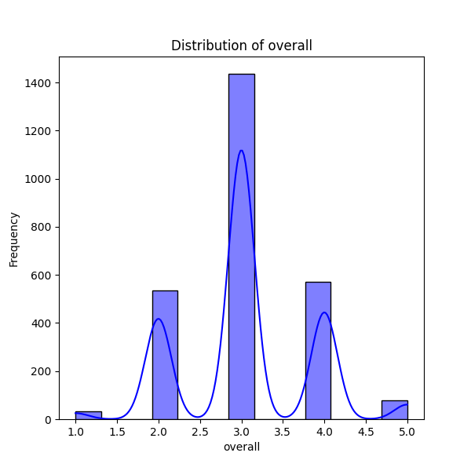
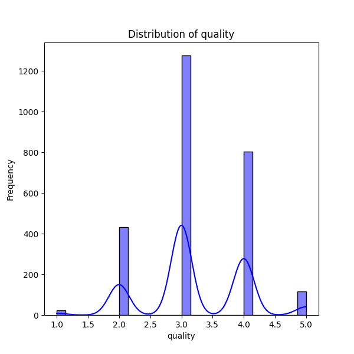
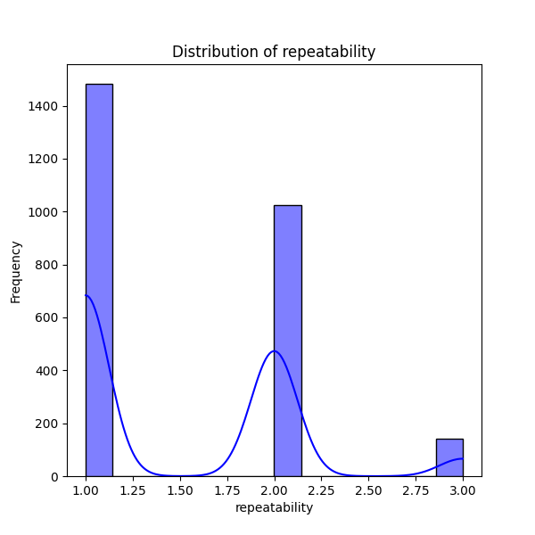

# Analysis Report

### Dataset Summary

The dataset consists of 2,652 entries with 8 columns encompassing various attributes related to media reviews. The key columns are:

- **date**: The review date (contains 99 missing values).
- **language**: The language in which the media is presented (no missing values).
- **type**: The type of media (no missing values).
- **title**: The name of the media (no missing values).
- **by**: The reviewer (262 missing values).
- **overall**: Overall rating given by reviewers, ranging from 1 to 5 (no missing values).
- **quality**: Quality rating ranging from 1 to 5 (no missing values).
- **repeatability**: A rating that assesses consistency, ranging from 1 to 3 (no missing values).

### Key Insights

1. **Missing Values**:
   - There are notable missing values in the `date` (99) and `by` (262) columns. Addressing these missing values is crucial for analysis, especially for insights based on reviewer trends.

2. **Language**:
   - The dataset includes reviews in 11 different languages, with English being the most common (1,306 entries).

3. **Type of Media**:
   - The predominant media type is "movie," with 2,211 entries, suggesting the dataset may be biased towards film reviews.

4. **Ratings**:
   - The `overall` rating has a mean of approximately 3.05 with a standard deviation of 0.76, indicating a fair distribution of ratings, centering more towards the average range.
   - The `quality` rating has a slightly higher mean of about 3.21, indicating that overall, respondents view the quality of the media a bit more positively than the overall experience.
   - The `repeatability` rating has a mean of approximately 1.49, suggesting a tendency towards reviews that do not believe in the media's consistency or repeat appeal.

5. **Frequency Analysis**:
   - The title "Kanda Naal Mudhal" has the highest review frequency (9), among a total of 2,312 unique titles, showing diversity in media entries.
   - Reviewer "Kiefer Sutherland" is the most reviewed with 48 reviews, hinting at a possible correlation between certain reviewers and specific types of media.

6. **Distribution Visualizations**:
   - The visual distributions of `overall`, `quality`, and `repeatability` provide a clearer understanding of how reviewers feel about different aspects:
     - **Overall Distribution**: Likely shows a peak around the middle scores, indicating possible satisfaction but also dissatisfaction reflected in lower scores.
     - **Quality Distribution**: Similarly might show that while most find the quality decent, there are outliers for lower quality.
     - **Repeatability Distribution**: Likely demonstrates a focus on lower scores, emphasizing concerns about the media's lasting appeal.

### Implications

- **Data Cleaning**: Missing values in `date` and `by` should be addressed to improve the dataset's robustness for analysis. Options include imputation or removal of these records if deemed insignificant.
  
- **Focused Analysis**: Given the prominence of movie reviews, specific analyses pertaining to this format can be prioritized, particularly identifying factors that lead to higher or lower ratings over time and by different reviewers.

- **Review Trends**: Analyzing the distribution of ratings over time could further uncover valuable trends related to changes in media quality or shifts in audience preferences.

- **Reviewer Influence**: The effect of particular reviewers on media ratings could be studied to determine if certain reviewers are seen as more credible or influential, which may lead to strategies for marketing or outreach by media producers.

Overall, this dataset provides an interesting opportunity to analyze media ratings and could lead to actionable insights for stakeholders in the media industry.

